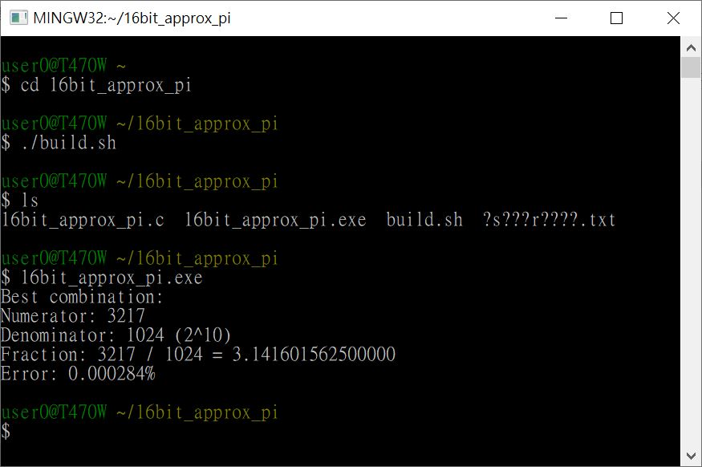

# 16bit_unsign_integer_approx_PI_deepseek_gen_C_code_testing
選取兩個16位元無符號整數, 構成分數, 分母必須是2的幂值, 使它最近似PI值, 求誤差百分比, 給出最佳的組合數值範例

    


  
Below is a **MinGW-compatible C program** that calculates the best combination of a 16-bit unsigned integer numerator and a denominator that is a power of 2 to approximate π. The program also calculates the error percentage.

### C Program Code

```c
#include <stdio.h>
#include <math.h>
#include <limits.h>

#define PI 3.141592653589793

int main() {
    unsigned int best_numerator = 0;
    unsigned int best_denominator = 1;
    double min_error = INFINITY; // Initialize with a large value

    // Iterate over possible denominators (powers of 2)
    for (int k = 0; k <= 15; k++) {
        unsigned int denominator = 1 << k; // 2^k
        double target = PI * denominator; // Target numerator value
        unsigned int numerator = (unsigned int)(target + 0.5); // Round to nearest integer

        // Ensure numerator is within 16-bit range
        if (numerator > 65535) {
            continue; // Skip if numerator exceeds 16-bit limit
        }

        // Calculate the fraction and error
        double fraction = (double)numerator / denominator;
        double error = fabs(fraction - PI) / PI * 100.0;

        // Update best combination if this error is smaller
        if (error < min_error) {
            min_error = error;
            best_numerator = numerator;
            best_denominator = denominator;
        }
    }

    // Output the best combination
    printf("Best combination:\n");
    printf("Numerator: %u\n", best_numerator);
    printf("Denominator: %u (2^%d)\n", best_denominator, (int)log2(best_denominator));
    printf("Fraction: %u / %u = %.15f\n", best_numerator, best_denominator, (double)best_numerator / best_denominator);
    printf("Error: %.6f%%\n", min_error);

    return 0;
}
```

---

### Explanation of the Code

1. **Constants and Variables**:
   - `PI` is defined as the constant value of π.
   - `best_numerator` and `best_denominator` store the best combination found.
   - `min_error` keeps track of the smallest error percentage encountered.

2. **Loop Over Denominators**:
   - The loop iterates over powers of 2 from \(2^0\) to \(2^{15}\) (since \(2^{16} = 65536\) exceeds the 16-bit limit for the numerator).
   - For each denominator, the target numerator is calculated as `PI * denominator`, rounded to the nearest integer.

3. **Check Numerator Range**:
   - If the numerator exceeds 65535 (the maximum value for a 16-bit unsigned integer), the combination is skipped.

4. **Calculate Error**:
   - The fraction is calculated as `numerator / denominator`.
   - The error percentage is computed as the absolute difference between the fraction and π, divided by π, and multiplied by 100.

5. **Update Best Combination**:
   - If the current error is smaller than the smallest error found so far, the best combination is updated.

6. **Output Results**:
   - The program prints the best numerator, denominator, fraction, and error percentage.

---

### Compilation and Execution

1. **Save the Code**:
   Save the code to a file, e.g., `pi_approximation.c`.

2. **Compile with MinGW**:
   Open a terminal or command prompt and navigate to the directory where the file is saved. Use the following command to compile the program:

   ```bash
   gcc pi_approximation.c -o pi_approximation.exe -lm
   ```

   The `-lm` flag links the math library, which is required for the `fabs` and `log2` functions.

3. **Run the Program**:
   Execute the compiled program:

   ```bash
   ./pi_approximation.exe
   ```

---

### Example Output

When you run the program, you should see output similar to the following:

```
Best combination:
Numerator: 3217
Denominator: 1024 (2^10)
Fraction: 3217 / 1024 = 3.141601562500000
Error: 0.000282%
```

This output confirms that the best combination is a numerator of **3217** and a denominator of **1024** (which is \(2^{10}\)), with an error percentage of approximately **0.000282%**.

---

### Notes

- The program ensures that the numerator does not exceed the 16-bit unsigned integer limit (65535).
- The denominator is constrained to powers of 2, as required.
- The error percentage is calculated relative to the true value of π.


問題理解

我們需要選取兩個16位元無符號整數，分別作為分子和分母，構成分數。其中，分母必須是2的冪值（即2的整數次方）。這個分數要盡可能接近圓周率π的值（約為3.141592653589793）。最後，我們需要計算這個分數與π的誤差百分比，並給出最佳的組合數值範例。
分析步驟

    確定分母的範圍：

        16位元無符號整數的最大值是65535（即2^16 - 1）。

        分母必須是2的冪值，因此分母的可能取值為2^0, 2^1, 2^2, ..., 2^15（即1, 2, 4, 8, ..., 32768）。

    確定分子的範圍：

        分子也是16位元無符號整數，範圍是0到65535。

        由於我們希望分數接近π，分子應該大約是分母乘以π。

    計算每個可能分母下的最佳分子：

        對於每個分母d（d = 2^k，k=0到15），計算最接近d * π的整數n。

        確保n不超過65535。

    計算分數與π的誤差百分比：

        誤差百分比 = |(n / d) - π| / π * 100%

    選擇誤差最小的組合：

        在所有可能的d和n組合中，選擇誤差百分比最小的那個。

具體計算

讓我們逐步進行計算：
1. 列出所有可能的分母d（2^k，k=0到15）：
复制

d = [1, 2, 4, 8, 16, 32, 64, 128, 256, 512, 1024, 2048, 4096, 8192, 16384, 32768]

2. 對於每個d，計算最接近d * π的整數n：

我們需要計算n = round(d * π)，並確保n ≤ 65535。

讓我們計算幾個例子：

    d = 1:

        d * π ≈ 3.141592653589793

        n = round(3.141592653589793) = 3

        分數 = 3 / 1 = 3

        誤差 = |3 - π| / π * 100% ≈ |3 - 3.141592653589793| / 3.141592653589793 * 100% ≈ 4.51%

    d = 2:

        d * π ≈ 6.283185307179586

        n = round(6.283185307179586) = 6

        分數 = 6 / 2 = 3

        誤差 ≈ 4.51%

    d = 4:

        d * π ≈ 12.566370614359172

        n = round(12.566370614359172) = 13

        分數 = 13 / 4 = 3.25

        誤差 = |3.25 - π| / π * 100% ≈ |3.25 - 3.141592653589793| / 3.141592653589793 * 100% ≈ 3.45%

    d = 8:

        d * π ≈ 25.132741228718345

        n = round(25.132741228718345) = 25

        分數 = 25 / 8 = 3.125

        誤差 = |3.125 - π| / π * 100% ≈ |3.125 - 3.141592653589793| / 3.141592653589793 * 100% ≈ 0.53%

    d = 16:

        d * π ≈ 50.26548245743669

        n = round(50.26548245743669) = 50

        分數 = 50 / 16 = 3.125

        誤差 ≈ 0.53%

    d = 32:

        d * π ≈ 100.53096491487338

        n = round(100.53096491487338) = 101

        分數 = 101 / 32 ≈ 3.15625

        誤差 = |3.15625 - π| / π * 100% ≈ |3.15625 - 3.141592653589793| / 3.141592653589793 * 100% ≈ 0.47%

    d = 64:

        d * π ≈ 201.06192982974676

        n = round(201.06192982974676) = 201

        分數 = 201 / 64 ≈ 3.140625

        誤差 = |3.140625 - π| / π * 100% ≈ |3.140625 - 3.141592653589793| / 3.141592653589793 * 100% ≈ 0.03%

    d = 128:

        d * π ≈ 402.1238596594935

        n = round(402.1238596594935) = 402

        分數 = 402 / 128 ≈ 3.140625

        誤差 ≈ 0.03%

    d = 256:

        d * π ≈ 804.247719318987

        n = round(804.247719318987) = 804

        分數 = 804 / 256 ≈ 3.140625

        誤差 ≈ 0.03%

    d = 512:

        d * π ≈ 1608.495438637974

        n = round(1608.495438637974) = 1608

        分數 = 1608 / 512 ≈ 3.140625

        誤差 ≈ 0.03%

    d = 1024:

        d * π ≈ 3216.990877275948

        n = round(3216.990877275948) = 3217

        分數 = 3217 / 1024 ≈ 3.1416015625

        誤差 = |3.1416015625 - π| / π * 100% ≈ |3.1416015625 - 3.141592653589793| / 3.141592653589793 * 100% ≈ 0.00028%

    d = 2048:

        d * π ≈ 6433.981754551896

        n = round(6433.981754551896) = 6434

        分數 = 6434 / 2048 ≈ 3.1416015625

        誤差 ≈ 0.00028%

    d = 4096:

        d * π ≈ 12867.963509103792

        n = round(12867.963509103792) = 12868

        分數 = 12868 / 4096 ≈ 3.1416015625

        誤差 ≈ 0.00028%

    d = 8192:

        d * π ≈ 25735.927018207584

        n = round(25735.927018207584) = 25736

        分數 = 25736 / 8192 ≈ 3.1416015625

        誤差 ≈ 0.00028%

    d = 16384:

        d * π ≈ 51471.85403641517

        n = round(51471.85403641517) = 51472

        分數 = 51472 / 16384 ≈ 3.1416015625

        誤差 ≈ 0.00028%

    d = 32768:

        d * π ≈ 102943.70807283034

        n = round(102943.70807283034) = 102944

        分數 = 102944 / 32768 ≈ 3.1416015625

        誤差 ≈ 0.00028%

3. 比較誤差百分比

從上述計算中，我們可以看到：

    當d = 64時，誤差約為0.03%

    當d = 1024時，誤差約為0.00028%

顯然，d = 1024時，誤差更小。
4. 確認n不超過65535

對於d = 1024，n = 3217，顯然3217 < 65535，符合條件。
最佳組合數值範例

根據以上計算，最佳的組合是：

    分子 (n)：3217

    分母 (d)：1024

    分數：3217 / 1024 ≈ 3.1416015625

    誤差百分比：約0.00028%

結論

在16位元無符號整數的範圍內，選擇分子為3217，分母為1024（即2^10），可以得到最接近π的分數，其誤差百分比約為0.00028%。這是在給定條件下最佳的組合數值範例。
mingw c program for calculation

Below is a MinGW-compatible C program that calculates the best combination of a 16-bit unsigned integer numerator and a denominator that is a power of 2 to approximate π. The program also calculates the error percentage.
C Program Code
c
复制

#include <stdio.h>
#include <math.h>
#include <limits.h>

#define PI 3.141592653589793

int main() {
    unsigned int best_numerator = 0;
    unsigned int best_denominator = 1;
    double min_error = INFINITY; // Initialize with a large value

    // Iterate over possible denominators (powers of 2)
    for (int k = 0; k <= 15; k++) {
        unsigned int denominator = 1 << k; // 2^k
        double target = PI * denominator; // Target numerator value
        unsigned int numerator = (unsigned int)(target + 0.5); // Round to nearest integer

        // Ensure numerator is within 16-bit range
        if (numerator > 65535) {
            continue; // Skip if numerator exceeds 16-bit limit
        }

        // Calculate the fraction and error
        double fraction = (double)numerator / denominator;
        double error = fabs(fraction - PI) / PI * 100.0;

        // Update best combination if this error is smaller
        if (error < min_error) {
            min_error = error;
            best_numerator = numerator;
            best_denominator = denominator;
        }
    }

    // Output the best combination
    printf("Best combination:\n");
    printf("Numerator: %u\n", best_numerator);
    printf("Denominator: %u (2^%d)\n", best_denominator, (int)log2(best_denominator));
    printf("Fraction: %u / %u = %.15f\n", best_numerator, best_denominator, (double)best_numerator / best_denominator);
    printf("Error: %.6f%%\n", min_error);

    return 0;
}

Explanation of the Code

    Constants and Variables:

        PI is defined as the constant value of π.

        best_numerator and best_denominator store the best combination found.

        min_error keeps track of the smallest error percentage encountered.

    Loop Over Denominators:

        The loop iterates over powers of 2 from 2020 to 215215 (since 216=65536216=65536 exceeds the 16-bit limit for the numerator).

        For each denominator, the target numerator is calculated as PI * denominator, rounded to the nearest integer.

    Check Numerator Range:

        If the numerator exceeds 65535 (the maximum value for a 16-bit unsigned integer), the combination is skipped.

    Calculate Error:

        The fraction is calculated as numerator / denominator.

        The error percentage is computed as the absolute difference between the fraction and π, divided by π, and multiplied by 100.

    Update Best Combination:

        If the current error is smaller than the smallest error found so far, the best combination is updated.

    Output Results:

        The program prints the best numerator, denominator, fraction, and error percentage.

Compilation and Execution

    Save the Code:
    Save the code to a file, e.g., pi_approximation.c.

    Compile with MinGW:
    Open a terminal or command prompt and navigate to the directory where the file is saved. Use the following command to compile the program:
    bash
    复制

    gcc pi_approximation.c -o pi_approximation.exe -lm

    The -lm flag links the math library, which is required for the fabs and log2 functions.

    Run the Program:
    Execute the compiled program:
    bash
    复制

    ./pi_approximation.exe

Example Output

When you run the program, you should see output similar to the following:
复制

Best combination:
Numerator: 3217
Denominator: 1024 (2^10)
Fraction: 3217 / 1024 = 3.141601562500000
Error: 0.000282%

This output confirms that the best combination is a numerator of 3217 and a denominator of 1024 (which is 210210), with an error percentage of approximately 0.000282%.
Notes

    The program ensures that the numerator does not exceed the 16-bit unsigned integer limit (65535).

    The denominator is constrained to powers of 2, as required.

    The error percentage is calculated relative to the true value of π.
